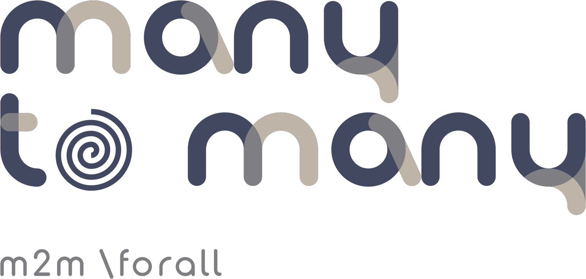

A general many-to-many relation manager with:

1) Automatic serialization
2) Automatic comparison and set-theory operations
3) Classical symbolic operations for sparse addressing (sum, difference, multiplication)
4) Generalized dependence lookup by node sets
5) Canonical representation of symmetry groups
6) Depth-first search from nodes and elements
7) Depth-first search for types
8) Topological ordering of nodes and elements
9) Topological ordering of types
10) Lexicographical ordering of all dependence relations
11) Automatic instantiation by means of builders

    And much more

The idea is to define a domain-specific "zoo", create the fauna, use domain-specific functions and avoid any hassles.

It is written in C++ because TINA
